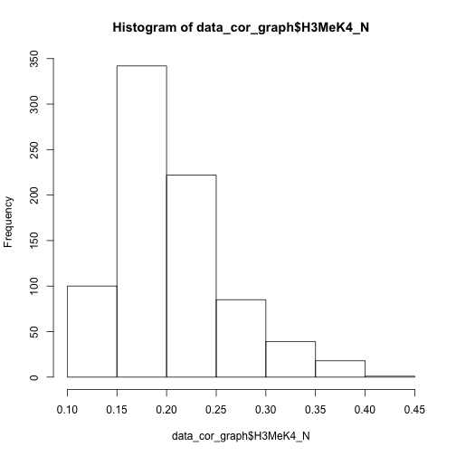
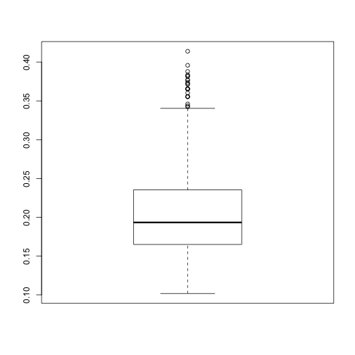

Subsetting ---- SAS ---- Variables
==============================
- keep <option>

```r
data dcn_sub;
  set dcn;
  keep MouseID DYRK1A_N ITSN1_N;
run;
```

Subsetting ---- SAS ---- Observations
=======================
- if <option>


```r
data dcn_sub_no_miss;
  set dcn;
  keep MouseID DYRK1A_N ITSN1_N;
	if MouseID ^= . OR DYRK1A_N ^=. OR ITSN1_N ^=.;
run;
/*
Subset based on value
*/
data dcn_sub_gt_50;
	set dcn_sub_no_miss;
	if DYRK1A_N > .5; 
run;
```

Subsetting ---- R ---- Variables
=======================

```r
library(knitr)
## grabs the three columns MouseID, DYRK1A_N, ITSN1_N
data_cortex <- read.csv("~/Desktop/data_cortex.csv")
data_cor_sub <- data_cortex[, c("MouseID", "DYRK1A_N", "ITSN1_N")]
kable(summary(data_cor_sub))
```


|   |    MouseID   |   DYRK1A_N    |   ITSN1_N     |
|:--|:-------------|:--------------|:--------------|
|   |18899_1 :   1 |Min.   :0.1453 |Min.   :0.2454 |
|   |18899_10:   1 |1st Qu.:0.2881 |1st Qu.:0.4734 |
|   |18899_11:   1 |Median :0.3664 |Median :0.5658 |
|   |18899_12:   1 |Mean   :0.4258 |Mean   :0.6171 |
|   |18899_13:   1 |3rd Qu.:0.4877 |3rd Qu.:0.6980 |
|   |18899_14:   1 |Max.   :2.5164 |Max.   :2.6027 |
|   |(Other) :1074 |NA's   :3      |NA's   :3      |

Subsetting ---- R ---- Observations
=======================

```r
data_cor_no_rm <- data_cor_sub[c(2,5),]
data_cor_no_rm
```

```
  MouseID  DYRK1A_N   ITSN1_N
2   309_2 0.5146171 0.6890635
5   309_5 0.4349402 0.6174298
```

Subsetting ---- R ---- Observations
=======================

```r
library(knitr) # for the kable function
## select all observations > .5
## on DYRK1A_N
data_cor_gt_.5 <- data_cor_sub[which(data_cor_sub$DYRK1A_N > .5),]
kable(head(data_cor_gt_.5))
```


|   |MouseID |  DYRK1A_N|   ITSN1_N|
|:--|:-------|---------:|---------:|
|1  |309_1   | 0.5036439| 0.7471932|
|2  |309_2   | 0.5146171| 0.6890635|
|3  |309_3   | 0.5091831| 0.7302468|
|16 |311_1   | 0.7431179| 0.8626527|
|17 |311_2   | 0.7114799| 0.8070539|
|18 |311_3   | 0.7046332| 0.8025372|


Subsetting ---- R 
======================
- In general, one can select rows of a dataframe by 
subsetting on l.h.s. of [,]'s

```r
name_of_df[rows,columns]
```
- one can select columns by subsetting on r.h.s. of [,]
- We can also use the ```{r, eval=FALSE} subset() ``` function

Activity 
======================

- Using either R or SAS:
- Import the Mouse cortex dataset
- Select the variables H3MeK4_N, TIAM1_N, Ubiquitin_N, Genotype, MouseID
- Remove missing values from the dataset
- Calculate the means of all of the numeric variables

Basic Statistical Graphics
======================

- Visualization is hugely important
- Histogram, Boxplot


Basic Statistical Graphics ---- Histogram
======================


```r
data_cor_graph <- data_cortex[,c("H3MeK4_N", "TIAM1_N",
            "Ubiquitin_N", "Genotype", "MouseID")]
data_cor_graph <- data_cor_graph[complete.cases(data_cor_graph),]
hist(data_cor_graph$H3MeK4_N)
```

 


```r
proc univariate data=dcn_sub_act;
  var H3MeK4_N;
  histogram;
run;
```

Basic Statistical Graphics ---- Boxplot
======================


```r
boxplot(data_cor_graph$H3MeK4_N)
```

 


Activity
======================
- Using either R or SAS:
- Take the variable H3MeK4_N
- Make a histogram and boxplot


Getting help with software
======================
- Google.com
- Stackoverflow.com
- SAS documentation (at your own risk!)
- R documentation
- TAs
